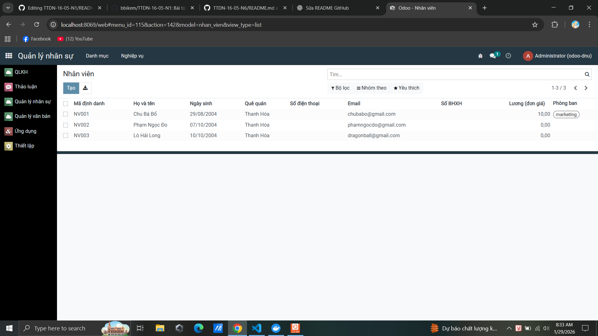

<h2 align="center">
    <a href="https://dainam.edu.vn/vi/khoa-cong-nghe-thong-tin">
    🎓 Faculty of Information Technology (DaiNam University)
    </a>
</h2>
<h2 align="center">
    Hệ Thống Quản Lý Nhân Sự, Khách Hàng và Văn Bản<br/>
    <small>Human Resources, Customer & Document Management</small>
</h2>
<div align="center">
    <p align="center">
        
        
        
    </p>

[](https://www.odoo.com/)
[](https://dainam.edu.vn/vi/khoa-cong-nghe-thong-tin)
[](https://dainam.edu.vn)

</div>
 
## 📖 1. Giới thiệu

Hệ thống **Quản lý Nhân Sự, Khách Hàng và Văn Bản** được xây dựng trên nền tảng **Odoo 17**, 
nhằm hỗ trợ doanh nghiệp và tổ chức trong việc:

- Quản lý thông tin nhân sự tập trung
- Theo dõi, lưu trữ và xử lý văn bản đến – đi
- Quản lý dữ liệu khách hàng và hồ sơ liên quan
- Đồng bộ dữ liệu giữa các bộ phận trong hệ thống

Hệ thống giúp **tăng hiệu quả quản lý, giảm thao tác thủ công và nâng cao tính chính xác dữ liệu**.

### 🎯 Lợi ích chính:
- ✅ Quản lý tập trung Nhân sự – Khách hàng – Văn bản
- ✅ Giảm phụ thuộc vào giấy tờ và Excel thủ công
- ✅ Dữ liệu liên kết, đồng bộ giữa các module
- ✅ Phân quyền rõ ràng, bảo mật thông tin
- ✅ Phù hợp cho cơ quan, doanh nghiệp, tổ chức hành chính


### 📌 Module Cốt Lõi:
1. **Quản lý Nhân Sự** – Hồ sơ nhân viên, phòng ban, chức vụ
2. **Quản lý Khách Hàng** – Thông tin khách hàng, liên hệ, hồ sơ
3. **Quản lý Văn Bản** – Văn bản đến, văn bản đi, lưu trữ & tra cứu

## 🎨 2. Các Tính Năng Chi Tiết

### 1️⃣ Quản lý Nhân Sự (HR Module) 
**Quản lý toàn bộ thông tin nhân viên và cấu trúc tổ chức**

<div align="center">
    
</div>

<br/>

<div align="center">

| Tính năng | Mô tả |
|-----------|-------|
| 📋 Hồ sơ nhân viên | Thông tin cá nhân, liên lạc, hộ khẩu, giấy tờ |
| 🏢 Quản lý phòng ban | Tạo, chỉnh sửa phòng ban, quản lý cấu trúc |
| 🎯 Quản lý chức vụ | Khai báo chức vụ, mô tả công việc, lương theo chức vụ |
| 📜 Hợp đồng lao động | Tạo, theo dõi, quản lý hợp đồng, gia hạn |
| 🎓 Kỹ năng & Đào tạo | Quản lý kỹ năng, khóa đào tạo, phát triển nhân sự |
| 📊 Sơ đồ tổ chức | Biểu đồ cấu trúc công ty, quan hệ cấp bậc |
| 🔄 Chuyển công tác | Thay đổi phòng ban, chức vụ, lương |

</div>

### 2️⃣ Khách Hàng (Customer Module) 
**Theo dõi các thông tin về khách hàng**

<div align="center">
    
</div>

<br/>

<div align="center">

| Tính năng | Mô tả |
|-----------|-------|
| 👤 Quản lý thông tin khách hàng | Lưu trữ mã KH, tên, email, số điện thoại, địa chỉ |
| 🏷️ Phân loại khách hàng | Cá nhân / Doanh nghiệp, theo mức thu nhập |
| 🔎 Tìm kiếm & lọc | Lọc theo loại KH, trạng thái, giới tính, độ tuổi |
| 📊 Nhóm & thống kê | Nhóm theo doanh thu, số đơn hàng, tình trạng |
| 📞 Lịch sử giao dịch | Theo dõi hợp đồng, cơ hội, lịch sử mua hàng |
| ⭐ Đánh dấu & yêu thích | Gắn sao, đánh dấu khách hàng quan trọng |
| 🔐 Quản lý trạng thái | Quản lý khách hàng mới, đang hoạt động, ngừng |
| 📈 Báo cáo khách hàng | Thống kê số lượng, doanh thu, tiềm năng |


</div>

### 3️⃣ Tài liệu văn bản (Document Management Module) 
**Tính toán lương, phụ cấp, khấu trừ, BHXH tự động**

<div align="center">
    
</div>

<br/>

<div align="center">

| Tính năng | Mô tả |
|-----------|-------|
| 📄 Quản lý văn bản | Quản lý văn bản đến, văn bản đi và văn bản lưu trữ |
| 🏷️ Phân loại văn bản | Phân loại theo loại văn bản: hợp đồng, công văn, thông báo |
| 👤 Liên kết khách hàng | Gắn văn bản với khách hàng liên quan |
| ✍️ Người ký & nơi nhận | Quản lý thông tin người ký, đơn vị nhận văn bản |
| 📅 Ngày ban hành | Theo dõi ngày ban hành, số văn bản |
| 📎 Đính kèm tệp | Lưu trữ file văn bản (PDF, Word, hình ảnh) |
| 📝 Mô tả & nội dung | Lưu nội dung tóm tắt, ghi chú văn bản |
| 🔄 Trạng thái xử lý | Soạn thảo – Đã ký – Đã ban hành – Lưu trữ |
| 🔍 Tra cứu văn bản | Tìm kiếm theo tên, số, loại, khách hàng |


</div>
## 🔧 3. Các công nghệ được sử dụng
<div align="center">

### Nền Tảng Chính
[](https://www.odoo.com/)
[](https://www.python.org/)

### Công nghệ Backend
[](https://www.postgresql.org/)
[](#)

### Công nghệ Frontend
[](#)
[](#)
[](#)

### Hệ điều hành


### Công cụ & Deployment
[](https://www.docker.com/)
[](https://docs.docker.com/compose/)
[](https://git-scm.com/)
</div>

## ⚙️ 4. Cài đặt và Chạy Hệ Thống

### 4.1. Yêu cầu hệ thống

- **Python 3.10+** 
- **PostgreSQL 12+**
- **Docker & Docker Compose** (khuyến nghị)
- **Git**
- **Ít nhất 4GB RAM**, 10GB dung lượng ổ cứng

### 4.2. Cài đặt sử dụng Docker (Khuyến nghị)

**Bước 1**: Clone project
```bash
git clone https://github.com/your-repo/odoo-fitdnu.git
cd odoo-fitdnu
```

**Bước 2**: Tạo file environment
```bash
cp .env.example .env
```

**Bước 3**: Khởi động hệ thống với Docker Compose
```bash
docker-compose up -d
```

**Bước 4**: Truy cập Odoo
- Mở trình duyệt: `http://localhost:8069`
- Tài khoản mặc định: `admin` / `admin`

### 4.3. Cài đặt trên máy chủ Linux (Ubuntu/Debian)

**Bước 1**: Cập nhật hệ thống
```bash
sudo apt update && sudo apt upgrade -y
```

**Bước 2**: Cài đặt các gói phụ thuộc
```bash
sudo apt install -y python3 python3-pip python3-dev postgresql postgresql-contrib \
    git libxml2-dev libxslt1-dev libzip-dev libsasl2-dev libssl-dev libffi-dev \
    libjpeg-dev zlib1g-dev
```

**Bước 3**: Clone project
```bash
cd /opt
sudo git clone https://github.com/your-repo/odoo-fitdnu.git
cd odoo-fitdnu
```

**Bước 4**: Tạo virtual environment
```bash
python3 -m venv venv
source venv/bin/activate
```

**Bước 5**: Cài đặt các dependency
```bash
pip install --upgrade pip
pip install -r requirements.txt
```

**Bước 6**: Cấu hình database PostgreSQL
```bash
sudo -u postgres createdb odoo_db
sudo -u postgres createuser -P odoo_user
# Nhập mật khẩu khi được yêu cầu
```

**Bước 7**: Chỉnh sửa file cấu hình
```bash
cp odoo.conf.template odoo.conf
# Sửa file odoo.conf:
# - db_name = odoo_db
# - db_user = odoo_user
# - db_password = <password>
```

**Bước 8**: Khởi chạy Odoo
```bash
./odoo-bin -c odoo.conf
# Hoặc sử dụng Python
python3 odoo-bin.py -c odoo.conf
```

**Bước 9**: Truy cập Odoo
- Mở trình duyệt: `http://localhost:8069`
- Tài khoản mặc định: `admin` / `admin`

### 4.4. Cài đặt trên Windows

**Bước 1**: Cài đặt Python 3.10+
- Tải từ https://www.python.org/downloads/
- Chọn "Add Python to PATH"

**Bước 2**: Cài đặt PostgreSQL
- Tải từ https://www.postgresql.org/download/windows/
- Ghi nhớ username và mật khẩu

**Bước 3**: Clone project
```bash
git clone https://github.com/your-repo/odoo-fitdnu.git
cd odoo-fitdnu
```

**Bước 4**: Tạo virtual environment
```bash
python -m venv venv
venv\Scripts\activate
```

**Bước 5**: Cài đặt dependencies
```bash
pip install --upgrade pip
pip install -r requirements.txt
```

**Bước 6**: Chạy Odoo
```bash
python odoo-bin.py -c odoo.conf
```

## 📚 5. Cấu hình các Module chính

### 5.1. Nhân Sự
- Settings → Employees → Employees

### 5.2. Khách Hàng
- Sales / Contacts → Customers

### 5.3. Văn Bản
- Documents → Documents
- Cấu hình phân quyền và danh mục văn bản

---


    
