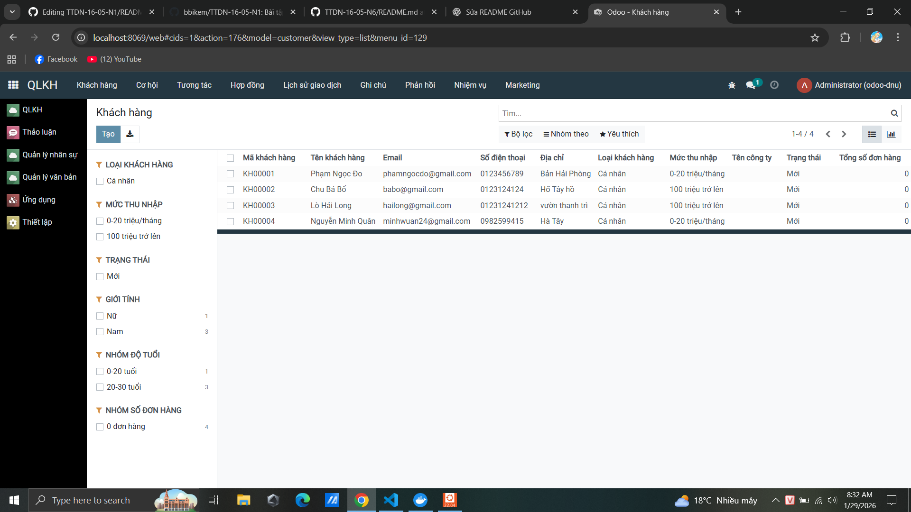
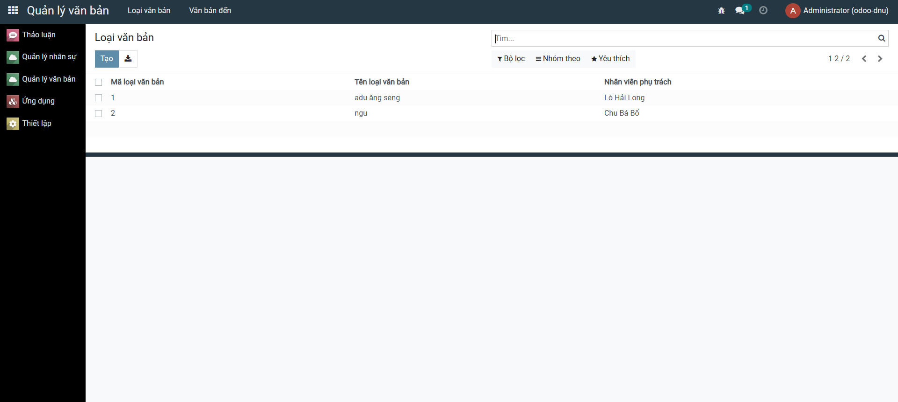

<h2 align="center">
    <a href="https://dainam.edu.vn/vi/khoa-cong-nghe-thong-tin">
    🎓 Faculty of Information Technology (DaiNam University)
    </a>
</h2>

<h2 align="center">
    Hệ Thống Quản Lý Nhân Sự, Khách Hàng và Văn Bản<br/>
    <small>Human Resources, Customer & Document Management System</small>
</h2>

<div align="center">
    <p align="center">
        
        
        
    </p>

[](https://www.odoo.com/)
[](https://dainam.edu.vn/vi/khoa-cong-nghe-thong-tin)
[](https://dainam.edu.vn)

</div>

---

## 📖 1. Giới thiệu

**Hệ Thống Quản Lý Nhân Sự, Khách Hàng và Văn Bản** được xây dựng dựa trên nền tảng **Odoo**, nhằm hỗ trợ doanh nghiệp và tổ chức trong việc quản lý tập trung và số hóa các nghiệp vụ cốt lõi, bao gồm:

- **Quản lý Nhân Sự (Human Resources)**
- **Quản lý Khách Hàng (Customer Management)**
- **Quản lý Văn Bản & Hồ Sơ (Document Management)**

Hệ thống giúp thay thế các phương pháp quản lý thủ công, rời rạc (Excel, giấy tờ), hướng tới một nền tảng **tập trung – bảo mật – dễ mở rộng – dễ sử dụng**.

---

## 🔧 2. Các công nghệ được sử dụng

<div align="center">

### Nền tảng chính
[](https://www.odoo.com/)
[](https://www.python.org/)

### Backend
[](https://www.postgresql.org/)
[](#)

### Frontend
[](#)
[](#)
[](#)

### Hệ điều hành


### Công cụ & Deployment
[](https://www.docker.com/)
[](https://docs.docker.com/compose/)
[](https://git-scm.com/)

</div>

---

## 🚀 3. Các tính năng chính

### 👥 Quản lý Nhân Sự (HR Module)
- Quản lý hồ sơ nhân viên, thông tin cá nhân và liên hệ
- Quản lý phòng ban, chức vụ, cơ cấu tổ chức
- Quản lý hợp đồng lao động, quá trình công tác
- Theo dõi trạng thái làm việc của nhân viên
- Phân quyền và vai trò người dùng

---

### 🤝 Quản lý Khách Hàng (Customer Module)
- Quản lý thông tin khách hàng, đối tác
- Lưu trữ lịch sử giao dịch, liên hệ
- Phân loại khách hàng theo nhóm, trạng thái
- Theo dõi quá trình chăm sóc khách hàng
- Hỗ trợ tích hợp CRM cơ bản

---

### 📄 Quản lý Văn Bản & Hồ Sơ (Document Module)
- Quản lý văn bản đến / đi
- Lưu trữ hồ sơ điện tử tập trung
- Phân loại văn bản theo loại, lĩnh vực, phòng ban
- Theo dõi trạng thái xử lý văn bản
- Phân quyền truy cập và bảo mật tài liệu

---

### 📊 Báo Cáo & Thống Kê
- Báo cáo nhân sự, khách hàng, văn bản
- Thống kê số lượng hồ sơ, tình trạng xử lý
- Dashboard tổng hợp dữ liệu
- Xuất báo cáo ra PDF, Excel

---

## 📸 3.1. Giao diện hệ thống

### Quản lý Nhân Sự


### Quản lý Khách Hàng


### Quản lý Văn Bản


---

## ⚙️ 4. Cài đặt và Chạy Hệ Thống

### 4.1. Yêu cầu hệ thống

- **Python 3.10+** 
- **PostgreSQL 12+**
- **Docker & Docker Compose** (khuyến nghị)
- **Git**
- **Ít nhất 4GB RAM**, 10GB dung lượng ổ cứng

### 4.2. Cài đặt sử dụng Docker (Khuyến nghị)

**Bước 1**: Clone project
```bash
git clone https://github.com/your-repo/odoo-fitdnu.git
cd odoo-fitdnu
```

**Bước 2**: Tạo file environment
```bash
cp .env.example .env
```

**Bước 3**: Khởi động hệ thống với Docker Compose
```bash
docker-compose up -d
```

**Bước 4**: Truy cập Odoo
- Mở trình duyệt: `http://localhost:8069`
- Tài khoản mặc định: `admin` / `admin`

### 4.3. Cài đặt trên máy chủ Linux (Ubuntu/Debian)

**Bước 1**: Cập nhật hệ thống
```bash
sudo apt update && sudo apt upgrade -y
```

**Bước 2**: Cài đặt các gói phụ thuộc
```bash
sudo apt install -y python3 python3-pip python3-dev postgresql postgresql-contrib \
    git libxml2-dev libxslt1-dev libzip-dev libsasl2-dev libssl-dev libffi-dev \
    libjpeg-dev zlib1g-dev
```

**Bước 3**: Clone project
```bash
cd /opt
sudo git clone https://github.com/your-repo/odoo-fitdnu.git
cd odoo-fitdnu
```

**Bước 4**: Tạo virtual environment
```bash
python3 -m venv venv
source venv/bin/activate
```

**Bước 5**: Cài đặt các dependency
```bash
pip install --upgrade pip
pip install -r requirements.txt
```

**Bước 6**: Cấu hình database PostgreSQL
```bash
sudo -u postgres createdb odoo_db
sudo -u postgres createuser -P odoo_user
# Nhập mật khẩu khi được yêu cầu
```

**Bước 7**: Chỉnh sửa file cấu hình
```bash
cp odoo.conf.template odoo.conf
# Sửa file odoo.conf:
# - db_name = odoo_db
# - db_user = odoo_user
# - db_password = <password>
```

**Bước 8**: Khởi chạy Odoo
```bash
./odoo-bin -c odoo.conf
# Hoặc sử dụng Python
python3 odoo-bin.py -c odoo.conf
```

**Bước 9**: Truy cập Odoo
- Mở trình duyệt: `http://localhost:8069`
- Tài khoản mặc định: `admin` / `admin`

### 4.4. Cài đặt trên Windows

**Bước 1**: Cài đặt Python 3.10+
- Tải từ https://www.python.org/downloads/
- Chọn "Add Python to PATH"

**Bước 2**: Cài đặt PostgreSQL
- Tải từ https://www.postgresql.org/download/windows/
- Ghi nhớ username và mật khẩu

**Bước 3**: Clone project
```bash
git clone https://github.com/your-repo/odoo-fitdnu.git
cd odoo-fitdnu
```

**Bước 4**: Tạo virtual environment
```bash
python -m venv venv
venv\Scripts\activate
```

**Bước 5**: Cài đặt dependencies
```bash
pip install --upgrade pip
pip install -r requirements.txt
```

**Bước 6**: Chạy Odoo
```bash
python odoo-bin.py -c odoo.conf
```

## 📚 5. Cấu hình các Module chính

### 5.1. Nhân Sự
- Settings → Employees → Employees

### 5.2. Khách Hàng
- Sales / Contacts → Customers

### 5.3. Văn Bản
- Documents → Documents
- Cấu hình phân quyền và danh mục văn bản

---

## 📌 Ghi chú
- Dự án phục vụ mục đích **học tập – nghiên cứu – thực hành Odoo**
- Có thể mở rộng thêm CRM, Workflow, chữ ký số trong tương lai
